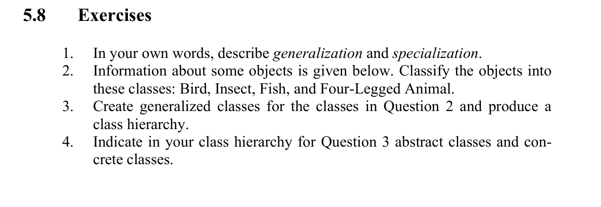

1-Generalization: The process of capturing and grouping all common properties of multiple subclasses into a single superclass.
This helps reduce redundancy by placing shared attributes and behaviors in one place.
Specialization: The opposite of generalization—it involves identifying differences and creating subclasses from an existing superclass to add unique properties and behaviors.

2 . Bird:Eagle, Hawk,
Insect:Bug,
Fish:Goldfish, Goldfish
Four-Legged:Ant, Dog, Tiger, Jaguar

3.

4.

```java
abstract class Animal {
}
abstract class Bird {
}
abstract class Insect {
}
abstract class Fish {
}
abstract class FourLegge {
}
class Eagle {
}
class Hawk {
}
class Insect {
}
class Goldfish1 {
}
class Goldfish2 {
}
class Ant {
}
class Dog {
}
class Tiger {
}
class Jaguar {
}
```
