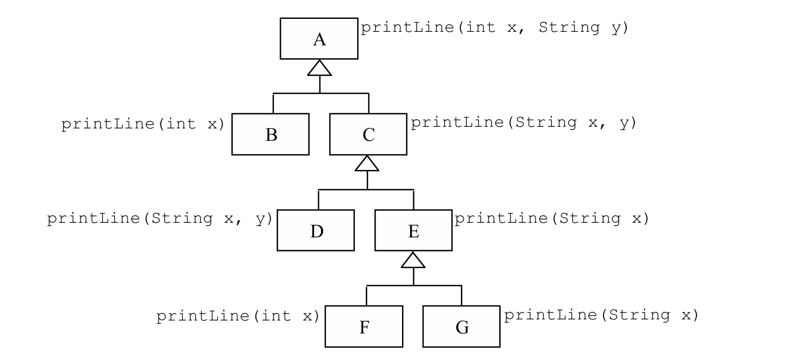

````markdown
# Object-Oriented Programming Concepts

## 1. Define and distinguish the terms single inheritance and multiple inheritance.

**Single inheritance** occurs when a subclass inherits from **one** superclass.  
**Multiple inheritance** occurs when a subclass inherits from **more than one** superclass.

## 2. Give an example of multiple inheritance in a real-life situation.


## 3. Class Relationships

A and B are two classes. A inherits properties from B.

- **A is a (Subclass) of B.**
- **B is a (Superclass) of A.**

## 4. Java Class Implementation


```java
public class B {
    // Attributes
    private int b1;
    private String b2;

    // Constructor
    public B(int b1, String b2) {
        this.b1 = b1;
        this.b2 = b2;
    }

    // Getter methods
    public int getB1() { return b1; }
    public String getB2() { return b2; }
}

public class A extends B {
    // Attributes
    private int a1;
    private String a2;

    // Constructor
    public A(int b1, String b2, int a1, String a2) {
        super(b1, b2);
        this.a1 = a1;
        this.a2 = a2;
    }

    // Getter methods
    public int getA1() { return a1; }
    public String getA2() { return a2; }
}
```
````

## 5. How does inheritance contribute to software reusability?

Inheritance allows a subclass to reuse all methods and attributes from a superclass **without needing to rewrite them**. This improves **code reusability** and **reduces redundancy**.

## 6. Method Resolution in Class Hierarchy



### Which class's `printLine()` method is used?

| Method Call                                           | Resolved Class           |
| ----------------------------------------------------- | ------------------------ |
| `z.printLine(1);`                                     | **Class F**              |
| `z.printLine(2, "Object-Oriented Programming");`      | **Class A**              |
| `z.printLine("Java");`                                | **Class E**              |
| `z.printLine("Object-Oriented Programming", "Java");` | **Class C**              |
| `z.printLine("Object-Oriented Programming", 3);`      | **Compilation Error** 🛑 |

## 7. What can you say about the method `printLine(String x)` of class G in Question 6?

- It **overrides** the `printLine(String x)` method from **Class E**.

## 8. Distinguish between contract inheritance and implementation inheritance.

- **Contract inheritance** refers to **inheriting method signatures** (abstract methods or interfaces) without implementation.
- **Implementation inheritance** refers to **inheriting both method signatures and their implementations** from a superclass.

## 9. Multiple Inheritance: Problems and Java's Solution

- **Problem:** When a class inherits from **two or more superclasses** that have the **same method but with different implementations**, it creates **ambiguity** since the compiler cannot determine which method to inherit.
- **Java’s Solution:**
  - Java **does not support multiple inheritance for classes** to avoid ambiguity.
  - Instead, Java provides **interfaces**, which allow multiple inheritance for **method signatures only**, ensuring that the implementing class defines the method.
- **Limitations of Interfaces:**
  1. **If there are no common methods or attributes shared, interfaces do not provide code reusability.**
  2. **Interfaces cannot contain instance variables or concrete method implementations (except default methods from Java 8 onward).**

## 10. Abstract Class vs. Interface


- **Neither is inherently better; each has its own use cases.**
- **Abstract classes** are useful when some shared implementation is required among subclasses.
- **Interfaces** are better when multiple classes need to follow the same contract but without shared implementation.

## 11. Expected Output of Java Code

```java
interface I {
  void x();
  void y();
}
class A implements I {
  A() {}
  public void w() { System.out.println("in A.w"); }
  public void x() { System.out.println("in A.x"); }
  public void y() { System.out.println("in A.y"); }
}
class B extends A {
  B() {}
  public void y() {
    System.out.println("in B.y");
  }
  void z() {
    w();
    x();
  }
  public static void main(String args[]) {
    A aa = new A();
    B bb = new B();
    bb.z();
    bb.y();
  }
}
```

### **Output:**

```
in A.w
in A.x
in B.y
```

```

```
